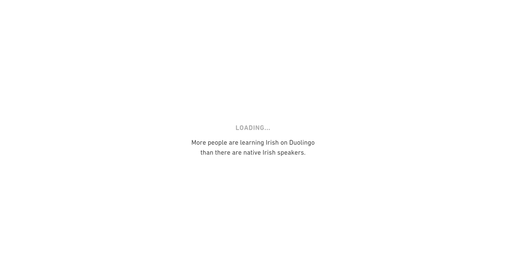
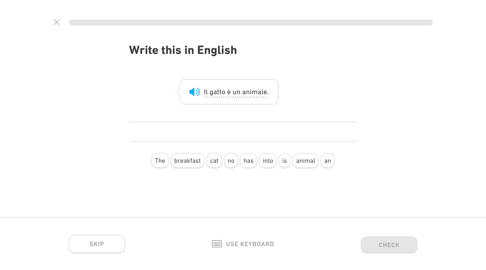

# User scripts and styles

Install a user script and style manager.

**Violentmonkey** and **Stylus** works by clicking the links with the file names below (github raw links).

**Stylish** works by opening the corresponding userstyles.org project link.

- Scripts: [Violentmonkey](https://violentmonkey.github.io/) / [Tampermonkey](https://www.tampermonkey.net/) / [Greasemonkey](https://www.greasespot.net/)
- Styles: [Stylus](https://add0n.com/stylus.html) / [Stylish](https://userstyles.org/help/stylish)

Find more:

- <https://www.userscript.zone/>
- <https://userstyles.org/>

## Duolingo

### Sync review sentences to Anki

Sync translation exercise 'Write in Italian/etc.' sentences to Anki.

- [duolingo-sync-sentences-to-anki.user.js](https://github.com/gambhiro/user-scripts-styles/raw/main/duolingo-sync-sentences-to-anki.user.js)

At the end of a Duolingo lesson, this script will extract the translation
exercise 'Write in Italian/etc.' sentences from the review scoreboard, and
sync them to Anki. The AnkiConnect plugin has to be installed in Anki.

If Anki is not open, a TSV (tab seperated values) list is shown.

The ANKI_DECK variable specifies the deck.

The AUTO_SYNC variable enables/disables auto-sync at the end of a lesson.

For stories, syncing has to be triggered with the keybinding below. It works
even at the beginning of a story, one doesn't have to wait until the last
sentence.

Ctrl+Alt+L (Cmd+Opt+L on Mac) triggers the syncing manually. This works
either at the end of a lesson, or on a story page.

In stories, it will sync the story sentences with a tag 'translate_me', since
the English translation is not on the page.

### Hide spoken text

Hide the text in Duolingo translation challenges and stories, to train hearing comprehension. Add Shift-Space keybinding to repeat the audio.

- [duolingo-hide-spoken-text.user.js](https://github.com/gambhiro/user-scripts-styles/raw/main/duolingo-hide-spoken-text.user.js)

### Hide the Hideous Dancing Owl

Hide the hideous dancing owl, infantile animated figures, distracting leader board, friends and other annoying stuff in Duolingo.

- [duolingo-hide-the-hideous-dancing-owl.user.css](https://github.com/gambhiro/user-scripts-styles/raw/main/duolingo-hide-the-hideous-dancing-owl.user.css)
- <https://userstyles.org/styles/247906/duolingo-hide-the-hideous-dancing-owl>

### Also recommended:

- [Darklingo++](https://userstyles.org/styles/169205/darklingo)
- [Pull from Duolingo](https://ankiweb.net/shared/info/557761805)

## YouTube

- Custom personal tweaks ([youtube-tweaks.user.css](https://github.com/gambhiro/user-scripts-styles/raw/main/youtube-tweaks.user.css))

### Also recommended:

- [Youtube Max Video Height](https://github.com/popiazaza/Youtube-Max-Video-Height)
- [YouTube Live Filled Up View](https://greasyfork.org/en/scripts/394945-youtube-live-filled-up-view)
